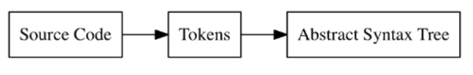

> Note: This readme will keep on evolving throughout the project

# The interpreter of Monkey Programming Language 🐒
This repo follows the book [Writing An Interpreter In Go](https://interpreterbook.com/), it writes an interpreter for a language called Monkey programming language. As per the author of the book, the language is primarily designed for the academic purposes.

### Few short notes about the Monkey language and its interpreter:
The interpreter we are building would a tree-walking interpreter. These interpreters parse the source code, make an `AST (abstract syntax tree)` out of it, then evaluate the tree. Monkey language has a c-like syntax and supports a bunch of features which will be implemented throughout. 
<br>
#### Have a look at some of the code snippets:
```
# Variable bindings
let name = "Monkey";
let result = 10 * (20 / 2);
```
Besides, int, bool, strings, our interpreter will also support arrays and hashes
```
let myArray = [1, 2, 3, 4, 5];
let thorsten = {"name": "Thorsten", "age": 28};
```

Functions will support implicit return statements, for example the below function implicity returns the sum of `a` and `b`.
```
let add = fn(a, b) { a + b; };
```
Below is a more complex `fiboncci` function
```
let fibonacci = fn(x) {
    if (x == 0) {
        0
    } else {
        if (x == 1) {
            1
        } else {
            fibonacci(x - 1) + fibonacci(x - 2);
        }
    }
};
```
<strong>The interpreter have a few major parts:</strong>
 - the lexer
 - the parser
 - the Abstract Syntax Tree (AST)
 - the internal object system
 - the evaluator

## Lexical analysis

We’re going to change the representation of our source code two times before we evaluate it. The first transformation, from source code to tokens, is called `lexical analysis` done by `lexer`. 
<br>
These tekens are then fed to parser, which converts it to an AST.
<hr>
Below is an input to lexer:

```
let x = 5 + 5;
```
And what comes out of the lexer looks kinda like this:
```
[
LET,
IDENTIFIER("x"),
EQUAL_SIGN,
INTEGER(5),
PLUS_SIGN,
INTEGER(5),
SEMICOLON
]
```
Note that whitespaces are insignificant here.

## Basic REPL:
`REPL` stands for "Read Eval Print Loop", a lot of interpreter based languages have REPL, and it is primarily used to use the language in shell/console. REPL will constantly keep on evolving in this project through multiple commits. We have Lexer ready, so the REPL supports that, support for EVAL will come later.